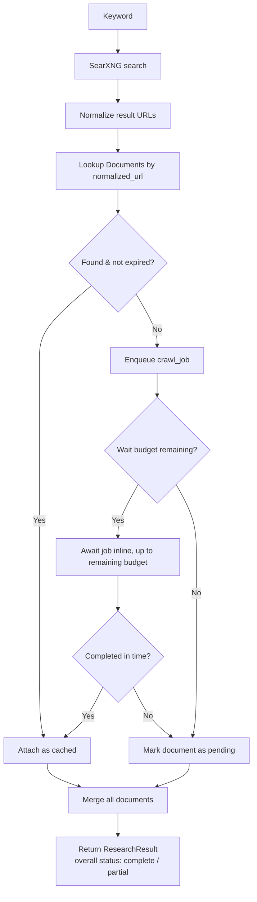
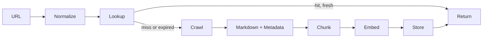

# Architecture

> Version: 2.0 (production revision of the original design)
> Status: Design approved, implementation not started
> See [nextsession.md](nextsession.md) for current progress.

## 1. Overview

Deep Research Backend is a Research API for AI Agents.

It is not a Search API and not a thin wrapper around Crawl4AI. It owns the
entire research pipeline and exposes exactly one primary operation:

```
POST /v1/research
```

Given a keyword, it returns a complete, structured, analyzable result set —
built from cached documents where possible and freshly crawled pages where
necessary — without the caller ever touching Search, Crawl, or Storage
directly.

The system has exactly four core concepts:

| Concept | Responsibility |
|---|---|
| **Search** | Discover candidate URLs for a keyword (online) or candidate documents (local/semantic) |
| **Document** | The single data model. Also the cache. Also the knowledge store. |
| **Job** | Background crawl/refresh/embedding work, queued in PostgreSQL |
| **API** | The only interface AI Agents talk to |

Every future data source (PDF, GitHub repo, RSS, Notion, Confluence, ...)
terminates in a `Document`. The core architecture never needs to change to
add a source.

## 2. Design Goals

- **API First** — one call in, one complete result out
- **Document First** — one data model for cache, storage, and search
- **Bounded-Wait First** — no endpoint blocks indefinitely on a crawl
- **Safety First** — the crawler fetches arbitrary URLs; SSRF and abuse
  protections are part of the architecture, not an afterthought
- **Single Infrastructure Dependency** — PostgreSQL is the only stateful
  service (queue, full text search, vector search, metadata)
- **Async First**, **Easy Deployment**, **Easy Extension**, **Production Ready**

## 3. Technology Stack

| Component | Technology | Why |
|---|---|---|
| API | FastAPI | async-native, typed request/response models |
| Search | SearXNG | self-hosted, no API key, aggregates multiple engines |
| Crawl | Crawl4AI | markdown-first extraction, LLM-friendly output |
| Database | PostgreSQL | one system for relational + FTS + vector |
| Vector | pgvector (HNSW index) | avoids a separate vector DB |
| Full Text Search | PostgreSQL `tsvector` | avoids Elasticsearch |
| Queue | PostgreSQL (`FOR UPDATE SKIP LOCKED`) | avoids Redis/RabbitMQ |
| ORM | SQLAlchemy (async) | typed models, migration-friendly |
| Migration | Alembic | schema versioning |
| Config | pydantic-settings | single typed config surface |

No Redis. No RabbitMQ. No Elasticsearch. No separate vector database.

## 4. High Level Architecture

```mermaid
flowchart TB
    Agent[AI Agent] -->|REST| API[Deep Research Backend API]
    API --> RS[Research Service]
    RS --> SS[Search Service]
    RS --> DR[Document Repository]
    SS --> SX[SearXNG]
    DR --> PG[(PostgreSQL\ndocuments / chunks / jobs)]
    PG --> CW[Crawl Worker\n(N instances)]
    CW --> C4[Crawl4AI]
    CW --> EMB[Embedding Service]
    EMB --> PG
```

Workers are stateless and horizontally scalable; all coordination happens
through PostgreSQL row locks. There is no worker-to-worker communication.

## 5. Core Workflow — Research

`/v1/research` is bounded by a **wait budget** (default 15s, configurable per
request). This is the key production correction to the original design: a
request that needs 5 fresh crawls cannot block the caller for however long
those crawls take.



Rules:

- A document that is already cached and not expired is **never** re-crawled
  inline. Only missing or expired documents create jobs.
- Jobs created but not completed within the wait budget are **not
  discarded** — they remain queued and a worker completes them
  asynchronously. The response marks the document `pending` and includes its
  `job_id` so the caller can poll `GET /v1/jobs/{id}` or re-issue
  `/v1/research` later, at which point it will be cached.
- The response always distinguishes `status: "complete"` (everything
  resolved) from `status: "partial"` (some documents still pending), so the
  calling agent knows whether it's safe to proceed or should retry.

## 6. Document Lifecycle & Cache Strategy

There is no separate cache layer. The `documents` table *is* the cache.



### 6.1 URL Normalization (cache key)

Normalization is what makes "already-crawled pages are never re-crawled"
true. Rules, applied in order:

1. Lowercase scheme and host
2. Strip default ports (`:80`, `:443`)
3. Strip fragment (`#...`)
4. Strip known tracking query params (`utm_*`, `gclid`, `fbclid`, `ref`, ...)
5. Sort remaining query params alphabetically
6. Strip trailing slash on path (except root `/`)

The normalized form is stored in `documents.normalized_url` with a unique
constraint. This is the only lookup key the pipeline ever uses.

### 6.2 Refresh / TTL Strategy

| Document type | TTL | Detection |
|---|---|---|
| Docs / reference | 30 days | domain heuristic + content-type |
| GitHub | 7 days | host == github.com |
| Blog | 7 days | default fallback |
| News | 6 hours | domain heuristic |

On lookup, an expired document is still returned immediately (stale data is
better than a slow response for an AI agent that just needs *something* to
reason about) while a refresh job is enqueued in the background. The caller
never waits on a refresh; only on a first-time crawl.

## 7. Security — Crawl Target Validation (SSRF)

The crawler accepts URLs derived from search results and from the
`/v1/crawl` endpoint, which can be called with an arbitrary URL. Before any
URL reaches Crawl4AI it passes through a mandatory validation stage:

- Resolve DNS and reject if the resolved IP is in a private/link-local/
  loopback range (RFC1918, `127.0.0.0/8`, `169.254.0.0/16` — this blocks
  cloud metadata endpoints such as `169.254.169.254`), or is a
  multicast/reserved range.
- Reject non-`http(s)` schemes.
- Re-validate on every redirect hop (no blind redirect following into a
  private IP).
- Enforce a max response size and a hard fetch timeout per page.
- Enforce a per-domain concurrency limit (politeness) independent of global
  worker concurrency.

This validation lives in a single `services/crawl/url_guard` module — no
other module is allowed to call Crawl4AI directly.

## 8. Search Pipeline

Three distinct retrieval modes, all normalized into `Document` results.

### 8.1 Online Search
`Keyword → SearXNG → URLs` — discovers new pages. Used by `/v1/research`.

### 8.2 Local Full Text Search
`Keyword → PostgreSQL tsvector → Documents` — searches already-crawled
content, no network calls. Used by `/v1/documents/search`.

### 8.3 Semantic Search
`Question → Embedding → pgvector (HNSW) over document_chunks → Documents`
— used for RAG / deep-research follow-up queries. Embeddings are computed
**per chunk**, not per document, so retrieval granularity matches what an
LLM actually needs in its context window.

## 9. Crawl Worker & Job Queue

Workers are a pull-based pool; there is no push/dispatch. Any number of
worker processes can run against the same PostgreSQL instance safely.

```sql
-- job claim, executed inside a transaction
SELECT * FROM crawl_jobs
WHERE status = 'pending' AND next_attempt_at <= now()
ORDER BY created_at
FOR UPDATE SKIP LOCKED
LIMIT 1;
```

Job state machine:

```
pending → running → completed
             │
             ├─→ failed (retryable: attempts < max_attempts)
             │     └─→ pending, next_attempt_at = now() + backoff(attempts)
             └─→ dead_letter (attempts >= max_attempts)
```

Worker pipeline per job:

```
Claim job → Guard URL (§7) → Crawl4AI → Markdown + Metadata
   → Chunk → Embed chunks → Upsert Document + Chunks (transaction)
   → mark job completed
```

Failures (timeout, guard rejection, extraction error) are recorded on the
job row with an error reason and retried with exponential backoff up to
`max_attempts`, after which the job moves to `dead_letter` and is visible via
`GET /v1/jobs?status=dead_letter` for operator inspection.

## 10. Result Composition for AI Consumption

This is the actual product: a single, analyzable payload. The response
schema (full detail in [SPEC.md](SPEC.md)) makes three things explicit for
the calling agent:

- **Per-document status** — `cached | crawled | pending | failed`, so the
  agent knows which documents are trustworthy-complete right now.
- **Ranking signal, not just order** — each document carries the score(s)
  that produced its position (`search_rank`, `semantic_score` when
  applicable), so the agent can re-weight or filter.
- **Token-budget-aware content** — every document includes a short
  `summary` (always present, bounded length) alongside the full `markdown`
  (present when within a configurable size cap; otherwise truncated with a
  pointer to `GET /v1/documents/{id}` for the full text). This keeps a
  multi-document research response usable directly in an LLM context window
  without the agent having to pre-filter.

## 11. Observability

- Structured (JSON) logs, one correlation `request_id` threaded through
  Search → Lookup → Crawl → Store for a given `/v1/research` call.
- Metrics: cache hit rate, crawl success rate, job queue depth,
  per-stage latency (search / crawl / embed), dead-letter count.
- `/health` (liveness) and `/ready` (DB connectivity) endpoints on both API
  and worker.

## 12. Deployment Topology

Single docker-compose stack for local/small production:

```
services: api (N replicas), worker (M replicas), postgres (with pgvector
extension), searxng, crawl4ai
```

API and worker scale independently. PostgreSQL is the only stateful service
and the only thing that needs backup/HA planning. See [BUILD.md](BUILD.md).

## 13. Project Structure

```
deep-research-backend/
├── app/
│   ├── api/                 # FastAPI routers (thin, no business logic)
│   ├── services/
│   │   ├── research/        # orchestrates search + lookup + crawl + merge
│   │   ├── search/          # SearXNG client, local FTS, semantic search
│   │   ├── crawl/           # Crawl4AI client, url_guard (§7), chunking
│   │   ├── document/        # normalization, TTL policy, upsert
│   │   └── worker/          # job claim loop, retry/backoff
│   ├── repositories/        # SQLAlchemy queries only, no business logic
│   ├── models/               # SQLAlchemy ORM models
│   ├── schemas/               # pydantic request/response models
│   ├── database/               # engine, session, migrations entrypoint
│   ├── config/                 # pydantic-settings, single source of config
│   └── utils/
├── migrations/                 # Alembic
├── tests/
├── docs/                        # this directory
├── AGENT.md
└── main.py
```

Module boundary rule: `api/` never imports `repositories/` directly, and
`repositories/` never imports `services/`. Data flows one direction:
`api → services → repositories → models`.

## 14. Future Extensions

No architectural change is required to add: PDF import, GitHub repository
ingestion, RSS, sitemap crawling, Notion, Confluence, AI summary
post-processing, multi-language support, or an MCP server front-end — each
is a new *source* that produces a `Document` through the existing pipeline.

## 15. Design Philosophy

```
Search → Document → Job → API
```

**Search** discovers. **Document** is the single model — cache and knowledge
store at once. **Job** does the background work so the API never blocks on
it longer than its wait budget. **API** is the one door an AI Agent walks
through; everything behind it is an implementation detail the agent never
needs to know about.
